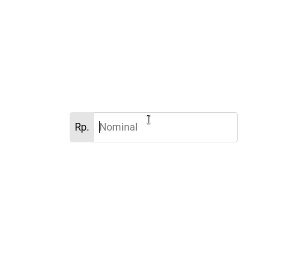

# Rupiaf.js

Rupiaf is a dead simple converter number to rupiah format. written with TypeScript and transform it to vanilla JS, no dependencies.

<p align="center"></p>

## Usage

### Basic
Load the production mode if you don't use any build tools.
```js
<!DOCTYPE html>
<html lang="en">
<head>
    <meta charset="UTF-8">
    <meta name="viewport" content="width=device-width, initial-scale=1.0">
    <meta http-equiv="X-UA-Compatible" content="IE=7">
    <title>Format Rupiah</title>
    <link rel="stylesheet" href="style.css">
</head>
<body>
    <main id="app">
        <div class="container">
            <div class="nominal-input">
                <label class="label" for="nominal">Rp.</label>
                <input id="nominal" type="text" name="nominal" placeholder="Nominal" autocomplete="off">
            </div>
        </div>
    </main>
    <script src="dist/scripts/index.js"></script>
    <script>
        document.querySelector("#nominal").addEventListener("keyup", (event) => {
            event.target.value = new Rupiaf(event.target.value).convert()
        });
    </script>
</body>
</html>
```
and then you can format given number on `Rupiaf` object, and then call `convert()` method.
```
const rupiah = new Rupiaf(10000).convert();
console.log(rupiah);
```
### For input text.
```
document.querySelector('.input').addEventListener('keyup', function(event) {
    event.target.value = new Rupiaf(event.target.value).convert();
});
```
Thanks.
